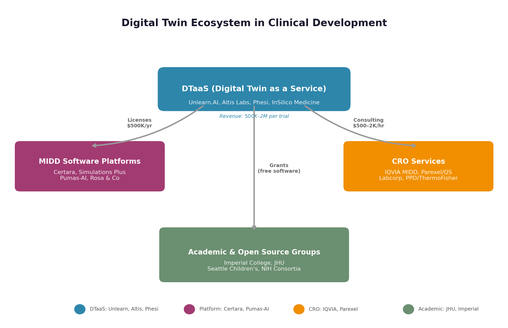
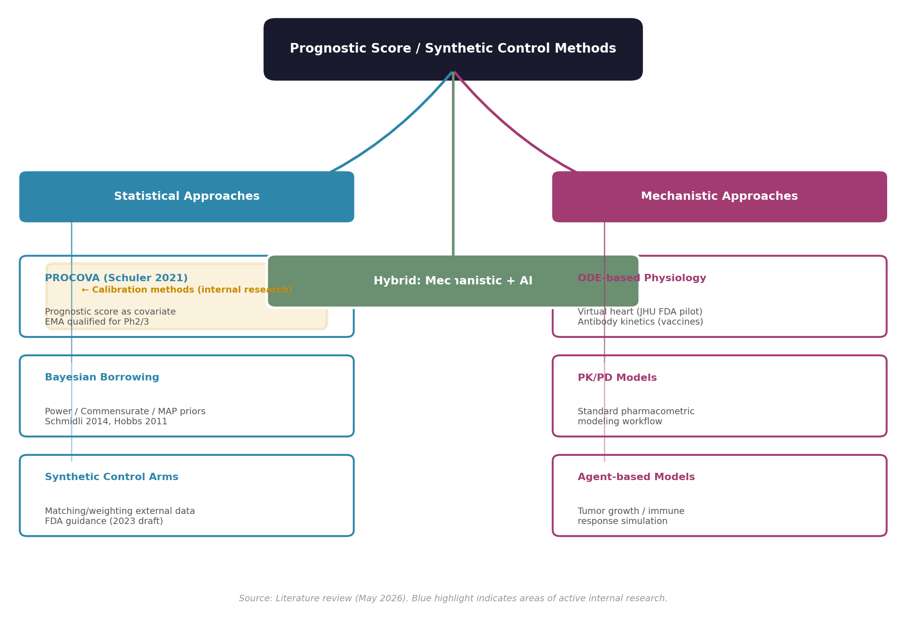
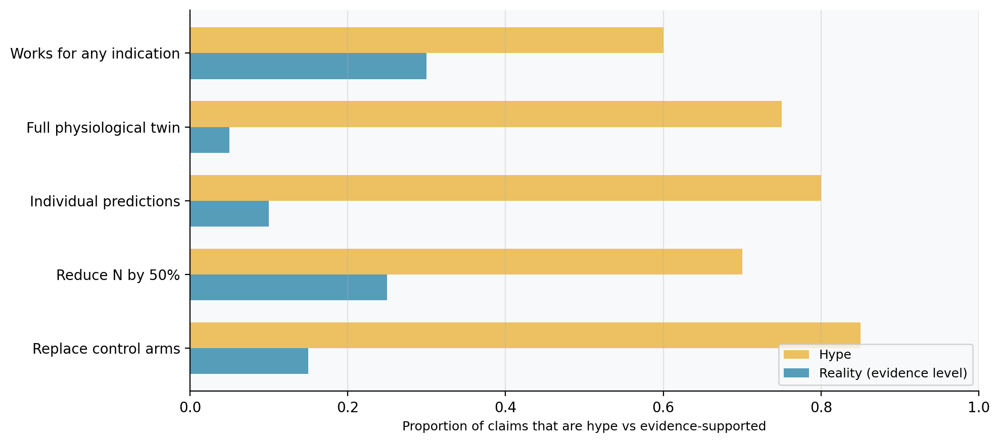

# Digital Twins in Clinical Development: A Landscape Survey (2021–2026)

**Author:** Yue Shentu  
**Date:** May 2026  
**Status:** Draft — separating hype from reality

---

## Executive Summary

Digital twins — computational models of individual patients used to simulate treatment responses — have become one of the most hyped concepts in clinical development. Vendors promise shorter trials, smaller control arms, and billions in savings. Regulators have responded with frameworks for AI credibility and model qualification. Meanwhile, most real applications remain in pilot settings, and the gap between the "full physiological twin" vision and what is actually feasible remains wide.

This survey maps the current landscape: regulatory guidance, vendor offerings, methodological approaches, case studies with real evidence, and an honest assessment of where the hype outruns the reality.

---

## Contents

1. [What Is a Digital Twin in Clinical Development?](#1-what-is-a-digital-twin-in-clinical-development)
2. [Regulatory Landscape](#2-regulatory-landscape)
3. [Vendor Ecosystem](#3-vendor-ecosystem)
4. [Methodological Approaches](#4-methodological-approaches)
5. [Evidence: What Has Actually Been Done?](#5-evidence-what-has-actually-been-done)
6. [The Hype-Reality Gap](#6-the-hype-reality-gap)
7. [Practical Considerations](#7-practical-considerations)
8. [What This Means for Merck](#8-what-this-means-for-merck)
9. [References](#9-references)

---

## 1. What Is a Digital Twin in Clinical Development?

### 1.1 Defining the Terms

The terminology around digital twins in healthcare is muddled — different vendors and publications use the same words to mean different things. A clear taxonomy is essential before evaluating claims.

| Term | Definition | Example |
|------|-----------|---------|
| **Digital Twin** | A dynamic computational model of an individual patient that is updated with real-time data. Originates from NASA/engineering (physical asset + digital replica + data link). | None fully exist in clinical trials yet |
| **Virtual Patient** | A static computational model of a patient, typically built from historical data. Not dynamically updated. | Most of what vendors call "digital twins" |
| **Synthetic Control Arm** | A counterfactual cohort constructed from historical or real-world data to replace or supplement a randomized control group. | Phesi's cGvHD twin, Unlearn's placebo predictions |
| **Prognostic Score** | A single numerical summary of a patient's predicted outcome under control, derived from a predictive model. | Any vendor-provided or internally developed score |
| **External Control Arm (ECA)** | Control group sourced from outside the trial (historical data, RWD), used when randomization is unethical or impractical. | FDA draft guidance on externally controlled trials |
| **Model-Informed Drug Development (MIDD)** | Umbrella term for using models in drug development; digital twins are a subset. | FDA MIDD Paired Meeting Program |

**Bottom line:** What most vendors call "digital twins" in 2026 are actually virtual patient models or synthetic control arms — not true digital twins in the engineering sense. True digital twins (dynamic, data-linked, continuously updating) remain aspirational in healthcare.

### 1.2 The Value Proposition

The core idea is compelling: if you can accurately predict what would happen to a patient on control, you can:

1. **Reduce control arm size** — fewer patients exposed to placebo
2. **Increase power** — more precise treatment effect estimates
3. **Shorten trials** — faster enrollment, fewer dropouts
4. **Enable trials where randomization is unethical** — rare diseases, oncology, pediatrics
5. **Identify responders** — personalized treatment effect estimation

The question is: how well does this actually work in practice?

---

## 2. Regulatory Landscape

### 2.1 Key Milestones

| Date | Agency | Action | Significance |
|------|--------|--------|-------------|
| Sep 2022 | EMA | Qualified PROCOVA for continuous outcomes in Ph2/3 trials | First-ever regulatory qualification of a DT-derived methodology |
| Feb 2023 | FDA | Draft guidance on externally controlled trials | Framework for when synthetic/EC arms may be acceptable |
| 2023 | EMA | PROCOVA qualification for phase 2/3 (official opinion) | Validated the concept commercially |
| Jan 2025 | FDA | AI Credibility Framework (7-step risk-based process) | How to establish model credibility for regulatory use |
| 2024 (draft) | ICH | M15 — global harmonized MIDD standards | Infrastructure for large-market expansion |
| Jan 2026 | FDA/EMA | "Guiding Principles of Good AI Practice" (10 principles) | Joint alignment on AI in drug development |
| 2025–26 | FDA | Multiple ISTAND submissions (Unlearn, etc.) | Pathway for novel methodologies |

### 2.2 FDA AI Credibility Framework (Jan 2025)

The FDA released a 7-step risk-based process for establishing AI model credibility:

1. **Define Context of Use (COU)** — what exactly will the model be used for?
2. **Assess Risk** — what's the cost of model error?
3. **Establish Credibility Goals** — what level of evidence is needed?
4. **Choose Assessment Approaches** — independent validation, cross-validation, etc.
5. **Execute Assessment** — generate evidence
6. **Document** — transparent reporting
7. **Maintain** — monitor performance over time

**Key insight:** The FDA doesn't require perfection — it requires that the model's limitations are understood and documented relative to its context of use.

### 2.3 FDA/EMA "Guiding Principles of Good AI Practice" (Jan 2026)

10 principles emphasizing:
- **Context of use** as the foundation for all validation
- **Transparency** about data sources, model architecture, and limitations
- **Reproducibility** — code and data should enable independent verification
- **Bias assessment** across demographic subgroups
- **Maintenance plans** for models that may drift over time

### 2.4 What This Means

The regulatory path for digital twin-derived methodologies exists but is rigorous:
- **PROCOVA** has the clearest path: it's already accepted under both EMA and FDA
- **Synthetic control arms** face higher scrutiny — they essentially replace randomization
- **No agency has approved a true digital twin** for a primary endpoint analysis
- The bar is lower for **ancillary/sensitivity analyses** and **trial design optimization**

---

## 3. Vendor Ecosystem

### 3.1 Market Structure

The digital twin space in clinical development has four segments:

```

```

### 3.2 Segment Profiles

#### Segment 1: DTaaS (Digital Twin as a Service)

**Unlearn.AI** (San Francisco)
- **What they do:** Market leader for synthetic control arms. Train hierarchical Bayesian models on historical trial data to predict each patient's placebo outcome.
- **Technology:** Neural Boltzmann Machines + PROCOVA. Deep generative models trained on historical trial databases.
- **Regulatory status:** EMA qualified (2022), FDA acknowledged (2024). PROCOVA covered under existing covariate adjustment guidance.
- **Pricing:** $500K–$2M per trial, depending on indication complexity.
- **Limitations:** 
  - Requires abundant historical placebo data → doesn't work well for novel mechanisms or pandemic scenarios
  - Statistical (not mechanistic) → less generalizable
  - PROCOVA assumes perfect calibration → simulations show this fails under population shift
  - Not transparent about the generative model architecture or validation data

**Altis Labs** (Toronto)
- **What they do:** AI-powered external control arms using imaging data matching.
- **Recent:** Presented at ISPOR 2025 — matching real-world imaging digital twins to create ECAs for Phase 3 NSCLC trials.
- **Differentiator:** Focus on imaging biomarkers as matching variables → potentially higher fidelity matching.
- **Status:** Early-stage, limited published validation.

**Phesi** (Boston/London)
- **What they do:** Digital trial arm services, protocol optimization.
- **Recent:** Published cGvHD digital twin proof-of-concept in *Bone Marrow Transplantation* (2024) — >2,000 virtual patients, matched historical ORR (52.7%).
- **Approach:** Real-world clinical data → virtual digital twin → "can potentially replace a control arm."
- **Limitations:** Proof of concept only; hasn't been used in a prospective regulatory submission.

#### Segment 2: MIDD Software Platforms

**Certara, Simulations Plus, Pumas-AI, Rosa & Co**
- **What they sell:** Software enabling pharma pharmacometricians to build/submit MIDD models.
- **Revenue model:** Software licenses + consulting + training.
- **Moat:** Deep regulatory relationships; existing EDC integration.
- **Weakness:** Requires in-house pharmacometricians → poor accessibility for small biotechs.

#### Segment 3: CRO-Embedded Modeling

**IQVIA (MIDD practice), Parexel (Quantitative Solutions), Labcorp (Covance), PPD (Thermo Fisher)**
- **What they sell:** Integrated modeling + clinical execution — one-stop shop.
- **Revenue:** $500–$2,000/hour for senior pharmacometricians, embedded in multi-year CRO contracts.
- **Moat:** Regulatory filing experience; access to proprietary historical databases.

### 3.3 What the Vendors Are NOT Saying

Critical gaps that vendors underemphasize:

1. **No true digital twin exists for clinical trials.** Every "digital twin" is a static model trained on historical data. They are not dynamically updated with patient data during the trial.

2. **External validity is unknown.** Models trained on historical trial data may not generalize to populations with different demographics, standard of care, or enrollment criteria.

3. **Population shift is ignored.** PROCOVA (and most vendors) assume the prognostic model is well-calibrated for the trial population. Our simulations show this fails under even moderate shift.

4. **Black-box models are the norm.** Most vendors don't disclose model architecture, training data provenance, or validation splits.

5. **Cost savings are theoretical.** The $500K–$2M per-trial fee often exceeds the cost of simply enrolling more patients.

---

## 4. Methodological Approaches

### 4.1 Taxonomy of Methods

```

```

### 4.2 PROCOVA in Detail

Since PROCOVA is the most advanced DT methodology, it deserves close examination.

**How it works:**
1. Historical data → train prognostic model → produces score S(W) for any patient
2. Trial enrolls patients → baseline covariates collected
3. Each patient receives a prognostic score = predicted outcome under control
4. Primary analysis: Cox/ANCOVA with S(W) as covariate

**Strengths:**
- Statistically principled (special case of ANCOVA)
- Preserves Type I error (by randomization, S(W) ⟂ A)
- EMA qualified, FDA acknowledged
- Flexible — any predictive model can generate the score

**Limitations:**
- **Assumes perfect calibration.** If S(W) is miscalibrated (population shift), power gains are reduced or reversed.
- **No diagnostic.** No way to detect miscalibration from trial data.
- **No adaptation.** The score is fixed — no mechanism to update it using trial data.
- **Sensitive to strong confounders.** If unmeasured confounders differ, bias can be substantial.

### 4.3 MAP Prior Borrowing (Schmidli 2014)

- Uses a Bayesian mixture prior: historical information + vague component
- Borrowing strength controlled by mixture weight
- Requires patient-level historical data (not just a score)
- Limited by commensurability — if historical and trial populations differ, the prior is down-weighted but the model doesn't adapt

### 4.4 Synthetic Control Arms (ECAs)

- Construct control cohort from external data using matching or weighting
- Regulatory acceptance is limited — FDA requires "compelling evidence" for replacing a control arm
- Major concerns: unmeasured confounding, temporal drift, selection bias
- Currently recommended for sensitivity/ancillary analyses, not primary inference

---

## 5. Evidence: What Has Actually Been Done?

### 5.1 Published Applications with Real Data

| Study | Year | Method | Outcome | Strength of Evidence |
|-------|------|--------|---------|---------------------|
| Phesi cGvHD twin | 2024 | Digital twin from RWD | Matched historical ORR (52.7%) | Proof of concept, no prospective use |
| JHU Virtual Heart | 2025 | Mechanistic cardiac model | 80% success (vs ~60% typical) | FDA pilot, n=10, promising but tiny |
| Altis MYSTIC ECA | 2025 | Imaging AI matching | ECA for Ph3 NSCLC | ISPOR poster, limited detail |
| Unlearn PROCOVA | 2022–24 | Bayesian + PROCOVA | Multiple trials, undisclosed | Limited public validation data |
| Internal calibration research | 2026 | Regularized score calibration | Simulation study | Ongoing internal work, manuscript in prep |

**Key observation:** There is not a single published case of a digital twin methodology being used as the **primary analysis** in a successful regulatory submission. Every application is either a simulation, a proof of concept, or a sensitivity analysis.

### 5.2 Simulation Evidence

Three simulation studies are particularly relevant:

1. **Schuler et al. (2021)** — PROCOVA proof of concept. 1,000 reps, limited scenarios. Showed power gains under ideal conditions (no shift).

2. **Ongoing internal calibration research.** Preliminary simulation results suggest that regularized calibration of prognostic scores can recover most of the power lost to population shift, with minimal penalty when no shift is present. A manuscript is in preparation.

---

## 6. The Hype-Reality Gap

### 6.1 What the Hype Claims

Based on vendor marketing, industry press, and consulting reports:

> "Digital twins will reduce trial timelines from 10-15 years to 5-7 years."
> 
> "Synthetic control arms can replace 50% of placebo patients."
> 
> "AI-powered digital twins predict patient outcomes with 95% accuracy."
> 
> "Every patient can have a personalized digital twin."

### 6.2 What the Evidence Actually Shows



| Claim | Reality Check |
|-------|--------------|
| "Replace control arms" | No published regulatory submission has used a DT as primary analysis. FDA guidance requires "compelling evidence." |
| "Reduce sample size by 50%" | PROCOVA simulations show ~15-30% reduction under ideal conditions. Under shift, gains can vanish. |
| "Predict individual outcomes" | Models predict *average* outcomes well but individual predictions have wide uncertainty intervals. |
| "Full physiological twin" | Roche's Christodoulou (2025): "remains on the horizon." Industry consensus: 5-7 years away. |
| "Works for any indication" | Most validation is in well-studied indications with abundant historical data (oncology, CNS). |
| "AI is the differentiator" | The statistical methodology matters more than the ML model. PROCOVA is essentially ANCOVA + a score. |

### 6.3 Sources of Hype

1. **Vendor incentives.** Per-trial pricing ($500K–$2M) creates incentives to oversell capabilities.
2. **Regulatory ambiguity.** "FDA acknowledged" ≠ "FDA approved." PROCOVA is "covered by existing guidance" — not a new qualification for synthetic control arms.
3. **Terminology inflation.** "Digital twin" sounds more impressive than "prognostic score adjustment" or "external control arm."
4. **Consulting industry.** McKinsey, BCG, Deloitte all have pharma AI practices that amplify the narrative.

### 6.4 A Realistic Assessment

**What digital twins CAN do today:**

- Improve power in well-understood indications with abundant historical data
- Supplement (not replace) randomized control arms
- Enable adaptive trial designs by simulating enrollment scenarios
- Identify enrichment strategies and patient subgroups

**What digital twins CANNOT do today:**

- Replace a randomized control arm as the sole basis for primary inference
- Predict individual patient outcomes with clinically actionable precision
- Generalize safely to populations with different standard of care
- Work for novel mechanisms with no historical precedent

---

## 7. Practical Considerations for Internal Use

### 7.1 Calibration of Vendor Scores Using Internal Data

A recurring theme across the digital twin landscape is the assumption that vendor-provided prognostic scores are well-calibrated for the target trial population. In practice, this assumption is often violated. Population shift between the historical data used to build a vendor's model and the actual trial — due to evolving standard of care, changing eligibility criteria, biomarker drift, or simple demographic differences — can substantially reduce the efficiency gain that PROCOVA or similar methods promise.

A pragmatic approach is to treat any externally-provided prognostic score as a starting point rather than a final product. The score can be evaluated and, if needed, fine-tuned using internal data:

- **Within a trial (blinded).** A calibration model can be fitted on the trial's own blinded data to detect and correct miscalibration. This approach preserves trial integrity (no unblinding needed) and tailors the score to the actual enrolled population. The ridge penalty protects against overfitting when the calibration sample is limited.

- **Outside a trial (historical internal data).** If a company has a rich repository of completed trial data, it can pre-calibrate vendor scores against its own internal benchmark before deploying them in new trials.

Neither approach requires trusting the vendor's claims about calibration. Both leverage the one asset that large pharmaceutical companies have that vendors typically do not: extensive, internally-validated clinical trial data.

### 7.2 Ongoing Internal Work

Work is underway to develop and validate this calibration framework.

---

## 8. Strategic Implications

### 8.1 Key Takeaways

1. **The "digital twin" label is heavily marketed** but the actual methods are well-understood statistical techniques (prognostic score adjustment, synthetic control arms, Bayesian borrowing). Don't let terminology drive strategy.

2. **Vendor scores should be treated as inputs, not oracles.** Any score — from Unlearn, Altis, Phesi, or an academic group — can be miscalibrated for a specific trial population. Internal validation and calibration are essential.

3. **Your own data is your biggest asset.** Merck's repository of completed trial data is something no vendor can match. Using it to validate, calibrate, or challenge vendor claims is the most defensible strategy.

4. **Blinded calibration within a trial is the cleanest approach.** It avoids unblinding, preserves trial integrity, and addresses population shift at the point of use.

5. **Don't overpay for black-box services.** Full-service "digital twin" offerings at $500K–$2M per trial are hard to justify when simpler statistical methods achieve comparable gains.

### 8.2 Potential Next Steps

| Action | Timeline | Effort | Notes |
|--------|----------|--------|-------|
| Internal calibration pilot | 2-3 months | Medium | Retrospective on completed trials |
| Vendor score evaluation framework | 1 month | Low | Standardized validation protocol |
| Engagement with regulators | 6-12 months | Medium | MIDD meeting for calibration methodology |
| Internal capability building | 3-6 months | Medium | R package, SOP, training

---

## 9. References

### Regulatory Documents

- FDA (2025). *Considerations for the Use of Artificial Intelligence to Support Regulatory Decision-Making for Drug and Biological Products.* Draft guidance.
- FDA/EMA (2026). *Guiding Principles of Good AI Practice for Drug Development.*
- FDA (2023). *Considerations for the Design and Conduct of Externally Controlled Trials for Drug and Biological Products.* Draft guidance.
- EMA (2022). *Qualification Opinion for PROCOVA.* EMA/CHMP/656613/2022.
- ICH (2024). *M15: Model-Informed Drug Development.* Draft.

### Academic Papers

- Schuler A, et al. (2021). *Increasing the power of randomized clinical trials using prognostic scores.* International Journal of Biostatistics.
- Schuler A, et al. (2022). *PROCOVA: A framework for prognostic covariate adjustment.* Journal of Biopharmaceutical Statistics.
- Hajage D, et al. (2018). *On the use of propensity scores in clinical trials.* Statistics in Medicine.
- Ibrahim JG, Chen M-H (2000). *Power prior distributions for regression models.* Statistical Science.
- Hobbs BP, et al. (2011; 2012). *Commensurate priors for incorporating historical information in clinical trials.* Biometrics.
- Schmidli H, et al. (2014). *Robust meta-analytic-predictive priors in clinical trials.* Statistics in Medicine.
- Lin DY, Wei LJ (1989). *The robust inference for the Cox proportional hazards model.* JASA.
- Friedman J, et al. (2010). *Regularization paths for generalized linear models via coordinate descent.* JSS.
- Hu EJ, et al. (2022). *LoRA: Low-Rank Adaptation of Large Language Models.* ICLR.

### Industry Reports

- Christodoulou D (Roche) (2025). Panel at OTC DACH Zurich: *"The Future of Digital Twins in Clinical Development."*
- Jonghoon K (2025). *The Business of Digital Twins in Drug Development.* [Blog series].
- Walsh et al. (2025). *Digital twins to improve efficiency and accuracy in clinical research.* Applied Clinical Trials.
- Li et al. (2024). *Digital twin model of first-line prednisone therapy in cGvHD.* Bone Marrow Transplantation.

### Internal Research

- Shentu Y (2026). Internal technical report on regularized calibration of external prognostic scores using blinded trial data.

---

*End of landscape survey. Draft for discussion.*
